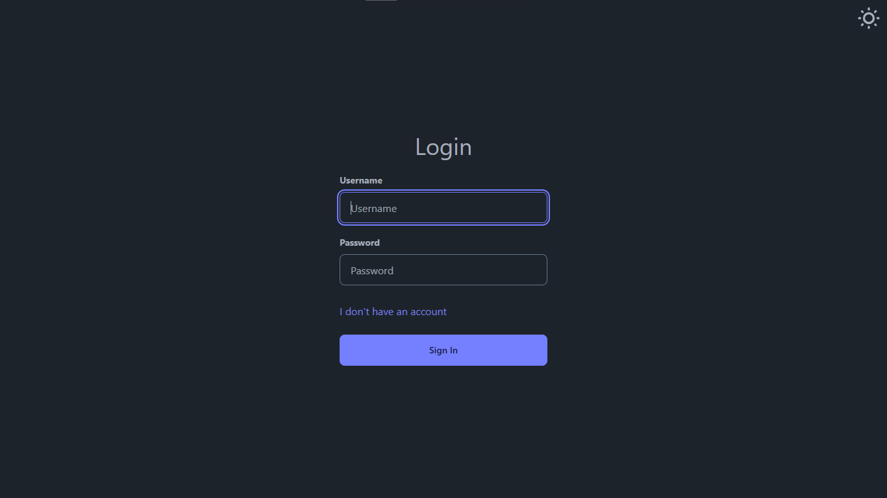
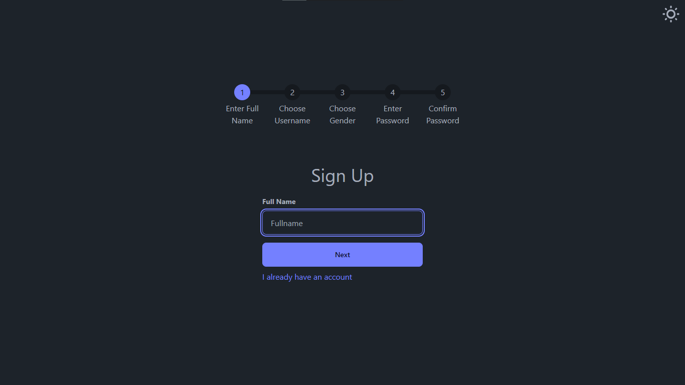
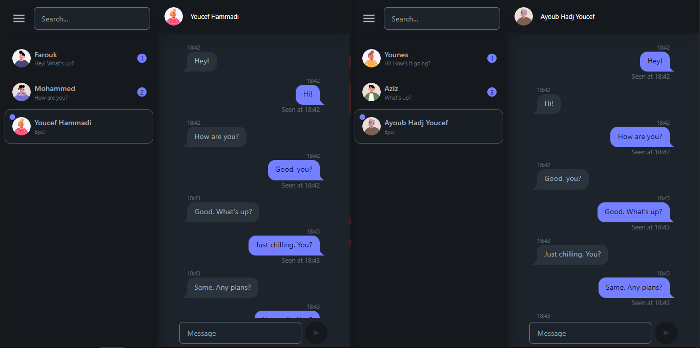

<h1 align="center">Real Time Chat App</h1>

This is a simple real-time chat application that allows you to chat with others in real time. :speech_balloon:

## :rocket: Features

- User authentication with JWT :lock:
- Real-time messaging with Socket.io :speech_balloon:
- State management with Zustand :clipboard:
- Styled with Tailwind CSS :nail_care:
- MongoDB for data storage :floppy_disk:

## :book: Installation

1. Clone the repository:

   ```bash
   git clone https://github.com/ucfx/react-chat.git
   ```

2. Navigate to the project directory:

   ```
   cd react-chat
   ```

3. Install the dependencies for both client and server folders:

   ```
    cd client && npm i && cd ../server && npm i && cd ..
   ```

4. Create a .env file in the server directory and add your environment variables. You can use the .env.example file as a template:

   ```
   cp server/.env.example server/.env
   ```

   Modify the `.env` file with your environment-specific variables.

5. Start the client:

   ```
   cd client && npm run dev
   ```

6. Open another terminal, navigate to the project directory, and start the server:

   ```
   cd server && npm run dev
   ```

7. Open your browser and visit http://localhost:5173.

8. Start chatting in real-time! :wink:

## :link: Demo

- <a target="_blank" href="https://react-chat-kk8v.onrender.com/"> Click Here </a> to try out a demo of the app.

## 🖼️ Screenshots





## :handshake: Contributing

Contributions are welcome! If you find any issues or have suggestions for improvements, please open an issue or submit a pull request.

## :page_with_curl: License

This project is licensed under the [MIT License](LICENSE.md).
